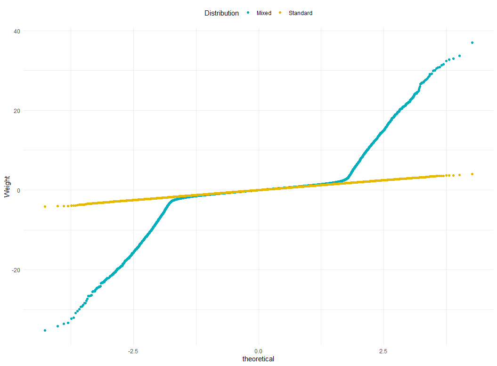
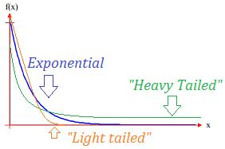

# (PART\*) PART I: GLM-Assumptions {-}


# Critical Assumptions {-}


In many fields of psychological research, variants of the general linear model (*GLM*) are used. In this model, an outcome variable $Y$ is predicted from a *linear* and *additive combination* of one or more predictor variables (*predictors*), i.e. $X_1, \cdots, X_n$. 

For each predictor, a *parameter* ($\hat{b}_i$, *slope*) is estimated from the data. This parameter represents the relationship between the predictor and outcome variable if the effects of other predictors in the model are held constant[^1].

There is also a parameter ($\hat{b}_0$, *constant/intercept*) to estimate the value of the outcome when all predictors are zero.

The errors in prediction are represented by the residuals ($\varepsilon_i$), which are (for each observation, $i$) the distance between the value of the outcome predicted by the model and the value observed in the data.

$$\begin{array}{c}
  \hat{Y}_i = \hat{b}_0 + \hat{b}_1 \cdot X_{1i} + \cdots + \hat{b}_n \cdot X_{1n} + \varepsilon_i
\end{array}$$

There are two common ways to estimated the parameters $\hat{b}_k$ with $k \epsilon \{0,n\}$:

  * using **O**rdinary **L**east **S**quares ([OLS](https://phet.colorado.edu/sims/html/least-squares-regression/latest/least-squares-regression_en.html "Ordinary Least Square Regression"){target="_blank"}) estimation: which seeks to minimize the squared errors between the predicted
  * **M**aximum **L**ikelihood (**ML**) estimation: which seeks to find the parameter values that maximize the likelihood of the observations.
  
> The OLS estimator will also be the maximum likelihood estimator (ML), when the assumptions of independent-, homoscedastic- and normally-distributed-errors are met! When these assumptions are not met, the ML estimator will yield different results to the OLS.
  
The **G**eneral **L**inear **M**odel (**GLM**) is a flexible framework through which to predict a continuous outcome variable from predictor variables that are/can be:

  * continuous (*regression* or *multiple regression*)
  * categorical (*ANOVA*) or
  * both (*ANCOVA*), or *Moderation-Analysis*, when interactions are modelled.
  
Similarly, experimental designs containing repeated measures and longitudinal data are special cases of a **multilevel linear model** in which observations (level 1) are nested within participants (level 2). If we include terms that estimate the variance across contexts (e.g., time) in both the constant ($\zeta_{0j}$) and model parameters (e.g., $\zeta_{1j}$) for each predictor, we get a multilevel model in which observations ($i$) are nested within contexts ($j$). These contexts could be individuals (e.g., repeated measures designs) or environments (e.g., classrooms).

$$\begin{array}{c}
  \hat{Y}_{ij} = \hat{b}_0 + \hat{b}_1 \cdot X_{ij} + (\zeta_{0i} + \zeta_{1j} \cdot X_{ij} + \varepsilon_{ij})
\end{array}$$

What we must not forget is that they are *all variants of the linear model* and, therefore, *have a common set of underlying assumptions!*. The two main assumptions are:

  1. additivity and linearity
  2. spherical residuals (= independent[^2] and homoscedastic[^3])

  > When applying this models we assume that the outcome variable is linearly related to any predictors and that the best description of the effect of several predictors is that their individual effects can be added together. As such, the **assumption of additivity and linearity is the most important** because it equates to the general linear model being the best description of the process of interest. When these conditions are met (and residuals have a mean of zero) then the linear model derived from OLS estimation will be a best linear unbiased[^4] estimator. **If this assumption is not true then you are fitting the wrong model**.
  
To summarize:

  1. When data is heteroscedastic, the formula for the variance of the parameters $\hat{b}_k$ is incorrect.
  2. Consequently, the estimation of the Standard Error $SE$ is incorrect.
  3. Autocorrelation introduces further bias to $SE$.
  4. Biased[^5] standard errors have important consequences for significance tests and confidence intervals (CI's) of model parameters (i.e. CI's can be extremely inaccurate when $SE$ is biased).
  
<!-- Bis hierher Seite 20, vor 2.2. Normality -->

[^1]: <font size="2"> trivial but worthwhile to note at this point: the parameters are estimated based on the observed data. As a consequence we must conclude, that if the data does not represent the outcome in the population, the parameters will NOT represent the relationship between the predictors and the *real world*.

[^2]: <font size="2"> Independent residuals are ones that are not correlated across observations. Correlation across residuals is known as *autocorrelation*.

[^3]: <font size="2"> *Homoscedastic* residuals are ones that have the same variance for all observations. Residuals without this property are called *heteroscedastic*.

[^4]: <font size="2"> **Unbiased** means that the estimator's expected value for a parameter matches the true value of that parameter.

[^5]: <font size="2"> a test statistic is **biased** if the probability of rejecting the null is not minimized when the null is true. </font>

# Normality {-}

Before looking into different problems with normality we shall have a closer look at distributions which seem to be normal but aren't! 

## Contaminated Normal distributions {-}

Before we dig into some details let us illustrate the effects of slight depatures form normality. Suppose we sample (an arbitrary variable) from the population of all adults. Within this sample about 10% are of age 70 and over. Let us assume, that the people younger than 70 have a mean $\bar{x}_Y = 0$ and a standard deviation of $sd_Y = 1$. The older people also show a mean of $\bar{x}_O = 0$, but there standard deviation is much higher, e.g. $sd_O = 10$. The following graph shows the standard normal distribution (*black*) vs. the mixed distribution of our example (<span style="color:blue">*blue*</span>). Again, only 10% of the data for this distribution has a different variance (<span style="color:red">*red*</span>). Do you think these distributions can be considered identical, or at least both of them are normally distributed?

<center>
{ width=50% }
</center>

If we observe such results on representative samples, we could assume, that the entire population has a *mixed*, or *contaminated distribution* with $\varepsilon = 0.1$ and $\lambda = 10$. So, in a formal way we would define two independent distributions ($X, Y$) with different standard deviations and different sample sizes which are mixed in a distribution $H$ with the variance of $Var(H)$, such that:

$$\begin{array}{l}
  X            &\approx N(\mu = 0, sd = 1) \\
  Y            &\approx N(\mu = 0, sd = \lambda) = N(\mu = 0, sd = 10) \\
  H            &= (1-\varepsilon) \cdot X + \varepsilon \cdot (x)  = 0.9 \cdot X + 0.1 \cdot Y\\
  \overline{H} &= E(H) = 0 \\
  Var(H)       &= E(H^2) \\
  E(H^2)       & = E(0.9 \cdot X^2 + 0.1 \cdot Y^2 + 2 \cdot X \cdot Y \cdot 0.9 \cdot 0.1) \\
               &=  0.9 \cdot \underbrace{E(X^2)}_{=1^2} + 0.1 \cdot \underbrace{E(Y^2)}_{=10^2} + 2 \cdot 0.9 \cdot 0.1 \cdot \underbrace{E(X \cdot Y)}_{\text{= Cov(X,Y)=0}} \\
               &=  0.9 \cdot 1 + 0.1 \cdot 100 = 10.9
\end{array}$$

If we look at the distribution plots, we notice that both (standard normal and contaminated normal) both look very similar. We could conclude, that the contaminated normal is approximating the standard normal distribution to such extent, that we can assume it is also a normal distribution.


``` r
  xfrom  <- -3
  xto    <- +3
  Mu     <- 0
  SD     <- 1
  Epsilon  <- 0.1 # percentage of smaller sample with higher std
  Lambda <- 10  # standard deviataion of smaller sample
  # x      <- seq(from = xfrom * Lambda, to = xto * Lambda, by = 0.1)
  x      <- seq(from = xfrom, to = xto, by = 0.1)
  N      <- length(x)
  Y1     <- NULL
  Y2     <- NULL
  # Y3     <- NULL
  CN     <- NULL
  
  for (i in 1:N) {
    Y1[i]    <- dnorm(x[i], mean = Mu, sd = SD) # std. normal component
    Y2[i]    <- dnorm(x[i], mean = Mu, sd = SD*Lambda) # contamination
    # Y2[i]    <- dnorm(x[i]/Lambda, mean = Mu, sd = SD) # contamination (same as above)
    CN[i] <- ((1 - Epsilon) * Y1[i]) + (Epsilon * Y2[i])
  }
  DF_CN  <- data.frame(xAxis = x, Standard = Y1, Contaminated = Y2, Mixed = CN)
    # probability density function (pdf) for one input z-value to
    # show the equivalence to the dnorm() function for the same parameters mean
    # and sd.
    # stddev <- 1
    # zwert  <- -3
    # Phi <- (1/sqrt(2*pi*stddev^2)) * exp(-0.5*(zwert/stddev)^2)
    # Y1[1] == Phi
  # ggplot(DF_CN, aes(x = xAxis)) + 
  #   geom_line(aes(y = Standard), color = "red") + 
  #   geom_line(aes(y = Contaminated), color = "blue") + 
  #   geom_line(aes(y = Mixed), color="black", linetype="twodash") 
  #
  # library(tidyverse)
  DF_CN_P1 <- DF_CN %>% 
              gather(key = "Distribution", value = "Value", -xAxis)
  # head(DF_CN_P1)
  P1 <- ggplot(DF_CN_P1, aes(x = xAxis, y = Value)) +
        # geom_line(aes(color = Distribution, linetype = Distribution), size = 1.3) + 
        geom_line(aes(color = Distribution), size = 1.3) + 
        scale_color_manual(values = c("red", "blue", "black")) +
        theme_bw()
  DF_CN_P1 <- subset(DF_CN_P1, Distribution == "Standard" | Distribution == "Mixed")
  P2 <- ggplot(DF_CN_P1, aes(x = xAxis, y = Value)) +
    geom_line(aes(color = Distribution), size = 1.3) +
    scale_color_manual(values = c("blue", "black")) +
    theme_bw()
```

Even so they look like almost identical, they are NOT! Notice the very slight difference at the left and right side (the tails) of the distribution. It might seem just a slight difference, but has in fact a quite dramatic impact on the variance. The variance for the standard normal (black) is 1, whereas for the combined normal (red) the variance is at 10.9 (c.f. to our results above)! We can simulate this effect quite easy - just copy and paste the following code and compare the results:


``` r
  NSim <- 50000
  set.seed(143)
  Y3 <- rnorm(NSim, mean = Mu, sd = SD)
  set.seed(3143)
  Y4 <- rnorm(NSim, mean = Mu, sd = SD * Lambda)
  z  <- sample(c(0,1),
               size    = NSim,
               prob    = c(1-Epsilon, Epsilon),
               replace = TRUE)
  Hx            <- Y3 * (1-z) + Y4 * z
  DF_Sim        <- data.frame(Standard = Y3, Contaminated = Y4, Mixed = Hx)
  DF_Sim_L      <- DF_Sim %>% gather(key = "Distribution", value = "Value")
  Res           <- summary_by(DF_Sim_L,Value ~ Distribution, FUN = c(mean, var))
  colnames(Res) <- c("Distribution", "Means", "Variances")
  Res[,2:3]     <- round(Res[,2:3], 2)
  knitr::kable(Res, caption = "Results of the simulation. Note the huge difference in the standard and mixed distribution.")
```


Table: (\#tab:Wilcox-2-Simiulation)Results of the simulation. Note the huge difference in the standard and mixed distribution.

|Distribution | Means| Variances|
|:------------|-----:|---------:|
|Contaminated |  0.03|    100.81|
|Mixed        | -0.03|     10.87|
|Standard     | -0.01|      1.00|

> In essence,  a small proportion of the population of participants can have an inordinately large effect on its value.

A look at the Q-Q-plot reveals the problem of the mixed distribution in a quite impressive way:

<!-- ```{r Wilcox-2-QQPlot, echo = FALSE, eval = TRUE, error=FALSE, message=FALSE, warning=FALSE, fig.align='center'} -->
<!-- ``` -->

<center>
{width=80%}
</center>
## Issues with normality {-}

There are three issues related to normality:

  1. normality of residuals ($\varepsilon_i$)
  2. Normal distribution of test statistics
  3. Confidence intervals

### Residuals {-} 
<!-- Field/Wilcox-2017 2.2 on page 20 -->
The well known (simple) regression model in its mathematical form is defined as:

\begin{equation}
  Y_i = b_0 + X_i \cdot b_1 + \varepsilon_i
\end{equation}
  
Each case ($i$) of data ($X_i$) has a residual $\varepsilon_i$, which is the difference between the predicted and observed values of the outcome. If you inspected a histogram of these residuals for all cases, you would hope to see a normal distribution centered around 0, i.e. $\bar{\varepsilon}_i = 0$. 

A mean residual of $\bar{\varepsilon}_i = 0$ means that the model (on average) correctly predicts the outcome value. In other words, if the residual is zero (or close to it) for most cases, then the error in prediction is zero (or close to it) for most cases. 

If the model fits well, we might also expect that very extreme over-, or underestimations occur rarely. A well fitting model then would yield residuals that, like a normal distribution, are most frequent around zero and very infrequent at extreme values. This description explains what we mean by normality of residuals.

> It also gives an idea of what it means if the normality of residuals is not given!

### Test statistics {-}

The $p$-values associated with the parameter estimates of the model are based on the assumption that the test statistic associated with them follows a normal distribution (or some variant of it such as the $t$-distribution).

Essentially, to test the hypothesis that the parameter estimate ($\bar{x}, r, \hat{b}_k$, etc.) is not equal to 0 (= $H_0$) it is necessary to assume a particular shape for the null distribution of the test statistic (i.e., normal).

If the sampling distribution of the test statistic turns out not to be the assumed shape (i.e. normal) then the resulting $p$-values will be incorrect.

> As a reminder: the $p$-value tells us about the probability to observe such data as our sample, IF the Null-Hyothesis ($H_0$) is True, i.e. $p(D|H_0)$! For the $H_0$ we (often) assume a normal distribution (or a deriviate of a normal, such as $\chi^2, F, t$).

### Confidence intervalls {-}

The bounds of confidence intervals for parameter estimates are constructed by adding or subtracting from the estimate the associated standard error multiplied by the quantile of a null distribution associated with the probability level assigned to the interval. 

$$\begin{array}{ccc}
  CI_{Mean} & = & \bar{x} \pm SE_{Mean} \cdot t_{crit}\\
  CI_{Corr} & = & r \pm SE_{Corr} \cdot t_{crit}\\
  CI_{Coef} & = & \hat{b}_k \pm SE_{Coeff} \cdot t_{crit} \\
  CI_{...}  & = & \cdots \pm SE_{...} \cdot t_{crit}
\end{array}$$

For tests of parameters in the linear model, the null distribution is assumed to be normal. It is an example of a general strategy in inferential statistics to convert an estimator, such as the mean, into a standardized statistic (z) that is asymptotically standard normal. The general issue is one of determining under what circumstances assuming normality gives a reasonably accurate result. 

# Myth and misconceptions about robustness {-}

> A common claim, based on the *central limit theorem*, is that with sample sizes greater than 30 the parameter estimate will have a normal sampling distribution. The implication being that if our sample is large we need not worry about checking normality to know that confidence intervals and p-values for a parameter estimate will be accurate. In which case, we can effectively ignore normality in all but quite exceptional cases of fitting a linear model. 

However, two things were missed when arriving at this conclusion:

  1. the conclusion is based on work using very light-tailed distributions.

<center>

{ width=40% }

</center>

  2. the assumption that Student's $T$ performs well if the sample mean has (to a close approximation) a normal distribution turns out to be incorrect under general conditions (Wilcox, 2016, 2017).

<!-- Paper Field page 21 kurz vor 3. Misconception about robustness -->
  
## Are GLM's robust? {-}

Recent investigations revealed that differences in: 

  * *skewness*
  * *non-normality* and
  * *heteroscedasticity* 

interact in complicated ways that impact power (Wilcox, 2017). It was believed that as *kurtosis* increases, the Type I error rate decreases and quickly drops below its nominal $\alpha = .050$ level, and consequently power decreases (Glass et al., 1972). 

> This conclusion is correct only if *distributions have the same amount of skewness*, because in this situation the difference between variables will have a *symmetric distribution*.

*Unequal variances* (violations of *homoscedasticity*), have relatively little influence when:

  * group sizes are equal and
  * the normality assumption is true

But when group sizes are unequal F varies as a function of whether the largest group has the smallest variance or vice versa (see Field, Miles, & Field, 2012, for a review).

> When normality cannot be assumed equal group sizes do not save F from violations of homoscedasticity (Wilcox, 2010, 2016, 2017).

## Validity of central limit theorem {-}

When distributions are symmetric and have light tails the sampling distribution of means is approximately normal using samples of only $N \approx 20$.

When distributions are asymmetric (skewed), even light-tailed distributions can require sample sizes of $N \approx 200$ (e.g. for one-sample t-tests). 

Heteroscedasticity, makes matters worse. When distributions have heavy tails samples need to be much larger (up to $N \approx 160$) before the sampling distribution is normal (Wilcox, 2010). 

> As such, researchers can be lured into a false sense of security that they can assume normality of the sampling distribution because of the central limit theorem.

<!-- Seite 21 letzer Absatz vor 4- What kind of data ... -->
  
