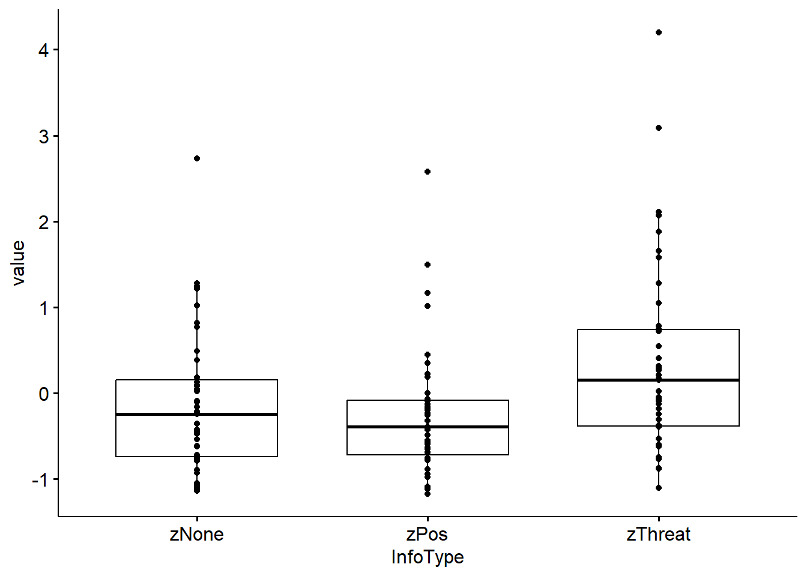

# (PART\*) PART III: R-Examples {-}


# R-Packages {-}

We will use the [WRS2](https://cran.r-project.org/web/packages/WRS2/WRS2.pdf "Wilcox Robust Statistics"){target="_blank"} (Mair, Schoenbrodt, & Wilcox, 2017), [robustbase](https://cran.r-project.org/web/packages/robustbase/robustbase.pdf "Basic Robust Statistics"){target="_blank"} (Rousseeuw et al., 2015), and [DescTools](https://cran.r-project.org/web/packages/DescTools/DescTools.pdf){target="_blank"} packages to access functions for some selected robust tests. 

Furthermore, packages such as [lme4](https://cran.r-project.org/web/packages/lme4/lme4.pdf "Linear Mixed-Effects Models"){target="_blank"} (Bates, Maechler, Bolker, & Walker, 2015) and [robustlmm](https://cran.r-project.org/web/packages/robustlmm/robustlmm.pdf "Robust Linear Mixed Effects Models"){target="_blank"} (Manuel Koller, 2016) for the multilevel model, and [lavaan](https://cran.r-project.org/web/packages/lavaan/lavaan.pdf "Latent Variable Analysis"){target="_blank"} (Rosseel, 2012) for the latent growth model will be used in the course of this workshop.

To access these packages, paste and copy the following code:


``` r
  rm(list = ls())
  graphics.off()
  options(digits = 2)
  if (!require("pacman")) install.packages("pacman")
  pacman::p_load(corrplot, corrr,
                 DescTools, dplyr,
                 ggplot2, ggridges, ggpubr,
                 knitr,
                 lavaan, lme4, 
                 nlme, 
                 pander,
                 readr, reshape, robustlmm, robustbase, rstatix,
                 tidyverse,
                 WRS2)
  
    ###############################################
```

*Note to the `DescTools` package:* the author's intention was to create a toolbox, which facilitates many of the tasks in data analysis, consisting of calculating descriptive statistics, drawing graphical summaries and reporting the results. The package contains furthermore functions to produce documents using MS Word (or PowerPoint) and functions to import data from Excel. Many of the included functions can be found scattered in other packages and other sources written partly by Titans of R. Important for us, robust methods such as robust estimators such as HuberM, TukeyBiweight, Robust data standardization, robust range, Yuen-t-Test, JarqueBeraTest, etc. can be found in this package.


*Note to the `tidyverse` package:* the tidyverse is an opinionated collection of R packages designed for data science. All packages share an underlying design philosophy, grammar, and data structures.

## Other Packages in R {-}

R is pretty well endowed with all sorts of robust functions and packages. For an extended overview see the additional packages for robust statistics on [CRAN](https://cran.r-project.org/web/views/Robust.html "addittional robust packages"){target="_blank"}. From this list we name just a few as examples for the manifold statistical application areas:

  - robust regression functions:
    * **rlm** in `MASS`       
    * **lmrob** and **nlrob** in `robustbase`
  - robust mixed-effects models - `robustlmm`
  - robust generalized additive models - `robustgam`
  - multivariate methods:
    * `rrcov` (robust multivariate variance-covariance estimation and robust principal components analysis (PCA))
    * `FRB` includes bootstrap based approaches for multivariate regression, PCA and Hotelling tests
    * `RSKC` functions for robust $k$-means clustering
    * `robustDA` performs robust discriminant analysis.

<!-- # Data {-} -->

<!-- The data used throughout this workshop can be downloaded from the Blackboard. Following data sets are included in the ZIP-File: -->

<!--   1. *FieldLawson2003.csv* [@FieldLawson.2003] -->
<!--   2. *fileKellyetalz.csv* [@Kelly.2010] -->
<!--   3. *FieldCH2008.csv* [@FieldCartwright.2008] -->
<!--   4. *RCTWide.csv* -->

<!-- A detailed description of the data can be found in Field & Wilcox [@FieldWilcox.2017], page 24.  -->

# Two independent means {-}

The data *fileKellyetalz.csv* [@Kelly.2010] can be downloaded from the Blackboard.The file contains the data from a survey that investigated whether verbal information or modelling were effective in reversing the effect of verbal threat information on children's fears of novel animals. 

Children aged 6-8 years old were given threat information or no information about two novel Australian marsupials. Following this information, different groups received one of three *interventions*:

  1. positive information about the threat animal
  2. a positive modelling experience (an adult placing their hand in a box seemingly containing the threat animal)
  3. no further experience. 

The children's *fear* of the marsupials was measured using a self-report measure called the **F**ear **B**eliefs **Q**uestionnaire (*FBQ*) or a **B**ehavioral **A**pproach **T**ask (*BAT*) like that described before. In the paper, the authors test the specificity of the interventions by comparing their effects on the subjective (FBQ) and behavioural (BAT) components of the fear emotion. To do so, a single score was computed separately for the *FBQ* and *BAT* that represented the change from pre-to post-intervention for the threat animal relative to the control animal. These scores, therefore, represent the overall effect of the intervention on each measure. The scores were converted to z-scores separately for the *FBQ* and *BAT* so that they could be compared. 

Note that because the interventions are expected to reduce fear, greater efficacy is shown up by more negative z-scores (i.e. greater reductions in fear). This part of the study had a *mixed design* with a between group manipulation of intervention:

 * positive information
 * non-anxious modeling
 * no intervention

and a repeated measures manipulation of the type of measure (*FBQ* or *BAT*). The data file contains 4 variables: 

  1. `id`: indicates the participant number; 
  2. `Intervention`: is a factor indicating whether the child received positive information, non-anxious modelling or no intervention, 
  3. `Measure`: indicates whether a score came from the *FBQ* or *BAT*
  4. `z`: is the z-score associated with the measure. 

Note that *FBQ* and *BAT* scores are in long format (contrasted with the wide format with which SPSS users will be more familiar).


``` r
    # Kelly et al. (2010)
    kellyz <- read.csv("Daten/Kellyetalz.csv")
    pander(head(kellyz, 6), digits = 3)
```


-------------------------------------------------
  id        Intervention       Measure      z    
------ ---------------------- --------- ---------
 egs1   Positive Information     BAT      0.204  

 egs1   Positive Information     FBQ     -0.614  

 lrx2   Positive Information     BAT     -0.0234 

 lrx2   Positive Information     FBQ      -1.49  

 zej3   Positive Information     BAT     -0.498  

 zej3   Positive Information     FBQ      -1.66  
-------------------------------------------------

## Standard t-Test {-}

We are going to compare the `FBQ` z-scores in two conditions: *positive information* vs. *No intervention*. To do this, we need to first select this subset of the data by executing these commands:


``` r
    posInfoFBQ <- subset(kellyz, Intervention!= "Non-Anxious Modelling" & 
                           Measure == "FBQ")
    posInfoFBQ$Intervention <- factor(posInfoFBQ$Intervention)
    pander(head(posInfoFBQ[order(posInfoFBQ$id),], 6))
```


------------------------------------------------------------
 &nbsp;     id         Intervention       Measure      z    
--------- ------- ---------------------- --------- ---------
 **60**    aqa30   Positive Information     FBQ     -1.837  

 **46**    asl23   Positive Information     FBQ     0.4333  

  **8**    bcv4    Positive Information     FBQ     -1.313  

 **44**    bgi22   Positive Information     FBQ     -0.5271 

 **16**    czq8    Positive Information     FBQ      1.219  

 **158**   dsl79     No Intervention        FBQ     0.5206  
------------------------------------------------------------

The standard function `stats::t.test()` returns the [Welch's](https://en.wikipedia.org/wiki/Welch%27s_t-test){target="_blank"} t-test statistic. It is also referred to as the *unequal variances t-test*. It is an adaptation of Student's t-test and is more reliable when:

  * the two samples have unequal variances and/or
  * unequal sample sizes.


``` r
    # pander(t.test(z ~ Intervention, data = posInfoFBQ, var.equal = TRUE))
    pander(t.test(z ~ Intervention, data = posInfoFBQ))
```


-------------------------------------------------------------------
 Test statistic    df         P value       Alternative hypothesis 
---------------- ------- ----------------- ------------------------
     7.119        53.01   2.896e-09 * * *         two.sided        
-------------------------------------------------------------------

Table: Welch Two Sample t-test: `z` by `Intervention` (continued below)

 
--------------------------------------------------------
 mean in group No Intervention   mean in group Positive 
                                      Information       
------------------------------- ------------------------
            0.6553                      -0.7867         
--------------------------------------------------------

## Robust t-Test {-}


``` r
    pander(YuenTTest(z ~ Intervention, data = posInfoFBQ))
```


--------------------------------------------------------------------------
 Test statistic    df     trim       P value       Alternative hypothesis 
---------------- ------- ------ ----------------- ------------------------
     6.244        28.84   0.2    8.371e-07 * * *         two.sided        
--------------------------------------------------------------------------

Table: Yuen Two Sample t-test: `z` by `Intervention` (continued below)

 
-----------------------------------------------------------
 trimmed mean in group No   trimmed mean in group Positive 
       Intervention                  Information           
-------------------------- --------------------------------
          0.6245                       -0.7701             
-----------------------------------------------------------

``` r
    pander(yuenbt(z ~ Intervention, data = posInfoFBQ))
```


  * **test**: _6.071_
  * **conf.int**: _0.9197_ and _1.869_
  * **p.value**: _0_
  * **df**: _NA_
  * **diff**: _1.395_
  * **call**: `yuenbt(formula = z ~ Intervention, data = posInfoFBQ)`

<!-- end of list -->

``` r
    ###############################################
```

We could report the robust test as a significant difference between trimmed mean `FBQ` z-scores in the positive information intervention compared to no intervention, $M_{diff} = 1.39 \ [0.91, 1.88], \ Y_t = 6.07, \ p < 0.001$.

# One-way ANOVA {-}

As in the previous example, we create a new data frame that includes only the `FBQ` data:


``` r
    fbqOnly <- subset(kellyz, Measure == "FBQ")
```

## Standard ANOVA {-}

The comparison of `FBQ` means across all three intervention groups can be done with an one-way independent ANOVA. We will compare the robust test to the classic linear model,
which can be obtained by executing:


``` r
    pander(summary(aov(z ~ Intervention, data = fbqOnly)))
```


-----------------------------------------------------------------
      &nbsp;        Df    Sum Sq   Mean Sq   F value    Pr(>F)   
------------------ ----- -------- --------- --------- -----------
 **Intervention**    2    39.02     19.51     30.29    4.314e-11 

  **Residuals**     104   66.98    0.6441      NA         NA     
-----------------------------------------------------------------

Table: Analysis of Variance Model

For the follow-up tests we will use the `pairwise.t.test()` function:


``` r
    pander(pairwise.t.test(fbqOnly$z, fbqOnly$Intervention, p.adjust.method = "bonferroni"))
```


  * **method**: t tests with pooled SD
  * **data.name**: fbqOnly$z and fbqOnly$Intervention
  * **p.value**:

    ---------------------------------------------------------------------
              &nbsp;             No Intervention   Non-Anxious Modelling
    --------------------------- ----------------- -----------------------
     **Non-Anxious Modelling**       0.04234                NA

     **Positive Information**       3.693e-11            4.819e-06
    ---------------------------------------------------------------------

  * **p.adjust.method**: bonferroni

<!-- end of list -->

## Robust One-way ANOVA {-}

The functions `t1waybt()` and `mcppb20()` take a similar form to `yuenbt()`:


``` r
    pander(t1waybt(z ~ Intervention, data = fbqOnly, tr = 0.2, nboot = 599))
```


  * **test**: _19.9_
  * **p.value**: _0_
  * **Var.Explained**: _0.6592_
  * **Effect.Size**: _0.8119_
  * **nboot.eff**: _599_
  * **call**: `t1waybt(formula = z ~ Intervention, data = fbqOnly, tr = 0.2,      nboot = 599)`

<!-- end of list -->

The robust test produces an effect size ($\equiv$ Pearson $r$). We observe a significant difference between the trimmed mean `FBQ` scores from the intervention groups, $F_t = 19.90, \ p < 0.001$. 

For the follow-up tests we will use the `mcppb20()` function.


``` r
    pander(mcppb20(z ~ Intervention,  data = fbqOnly, tr = 0.2, nboot = 599))
```


  * **comp**:

    --------------------------------------------------------
     Group   Group   psihat   ci.lower   ci.upper   p-value
    ------- ------- -------- ---------- ---------- ---------
       1       2     0.3825   0.06236     0.7359       0

       1       3     1.395     0.8521     1.859        0

       2       3     1.012     0.4973     1.558        0
    --------------------------------------------------------

  * **fnames**: _Positive Information_, _Non-Anxious Modelling_ and _No Intervention_
  * **call**: `mcppb20(formula = z ~ Intervention, data = fbqOnly, tr = 0.2,      nboot = 599)`

<!-- end of list -->

``` r
    ###############################################
```

The post-hoc tests tell us the difference between trimmed means, the associated bootstrap confidence interval, and the p-value for this difference. 

Based on the trimmed mean difference in `FBQ` scores, the intervention was significantly more effective for positive information than modeling, $\hat{\psi} = 0.38 \  [0.07, 0.76]$, and no intervention, $\hat{\psi} = 1.39  \ [0.87, 1.89]$, and for modeling compared to no intervention, $\hat{\psi} = 1.01 \ [0.42, 1.57]$.

# Two dependent means {-}


``` r
  # Field & Lawson (2003)
    # fieldWide <- read.csv("Daten/FieldLawson2003.csv")
    # head(fieldWide, 5) 
    # fieldLong <- read.csv("Daten/FieldLawson2003Long.csv")
    # head(fieldLong, 5)
  # Kelly et al. (2010)
    # kellyz <- read.csv("Daten/Kellyetalz.csv")
    # head(kellyz, 5) 
    # kellyz[c(1:6, 91:96, 181:186),]
  # Field & Cartwright-Hatton (2008)
    # fieldCH <- read.csv("Daten/FieldCH2008.csv")
    # head(fieldCH, 5)
  # RCT data
    rctLong <- read.csv("Daten/RCTLong.csv", header = T)
    rctWide <- read.csv("Daten/RCTWide.csv", header = T) 
    # head(rctWide, 5)

    ###############################################
```

The data used in this example (*FieldLawson2003.csv*, *FieldLawson2003Long.csv*) can be downloaded from the Blackboard [cf. @FieldLawson.2003].


``` r
    # Field & Lawson (2003)
    fieldWide <- read.csv("Daten/FieldLawson2003.csv")
    fieldLong <- read.csv("Daten/FieldLawson2003Long.csv")
    pander(head(fieldWide, 5), digits = 2)
```


-----------------------------------
  id    zThreat    zPos     zNone  
------ --------- --------- --------
 gup1    -0.38     -1.1     0.016  

 wdd2      1        2.6     -0.094 

 epr3    -0.19    -0.0017   -0.11  

 gna4    0.75      -0.95     0.38  

 gnn5    -0.06     -1.1     -0.22  
-----------------------------------

``` r
    pander(head(fieldLong[order(fieldLong$id),], 6), digits = 2)
```


------------------------------------------
 &nbsp;     X     id     InfoType   value 
--------- ----- ------- ---------- -------
 **23**    23    aal26   zThreat    0.016 

 **66**    66    aal26     zPos     -0.23 

 **109**   109   aal26    zNone     -0.62 

 **36**    36    aco50   zThreat    0.21  

 **79**    79    aco50     zPos     0.34  

 **122**   122   aco50    zNone     -0.54 
------------------------------------------

In this experiment, children aged 6-9 years were given verbal information about two novel Australian marsupials that contained:

  * either threat, or 
  * positive content. 
  
A third marsupial, about which no information was given, acted as a control. (The type of information was counterbalanced across animals for different children). 
After the information, children were asked to approach three boxes that they were told contained the animals (in fact they did not). *Latency* to approach the boxes acted as a behavior measure of their fear of these animals. 

This part of the experiment has a one-way repeated measures design (children approached all three boxes). The *approach times* were *reported as z-scores* where a positive score indicates that children took longer than average to approach, 0 represents the average approach time, and a negative score is indicative of being faster than average to approach.

The data frame `fieldWide` contains 4 variables: 

  1. `id`: indicates the participant code 
  2. `zThreat`: threat information
  3. `zPos`: positive information
  4. `zNone`: no information

A version of this data file in ‘long’ format (*FieldLawson2003Long.csv*) contains these data (`fieldLong`) restructured into four variables: 

  1. `x`: consecutive number (not used for the analysis)
  2. `id`: as above
  3. `InfoType`: codes whether a score relates to an animal about which threat, positive or no information was given, and
  4. `value`: contains the z-score for the time for a given child to approach a given box. 

## Check Assumptions {-}

Explore the data by drawing boxplot, histograms and if desired some descriptive statistics. Discuss the results of your analysis. 


``` r
  boxplot(value ~ InfoType, fieldLong) # use Long Format Data
```


``` r
    DF <- fieldWide %>% gather(InfoType, value, 2:4) # or change to Long
    DF$InfoType <- as.factor(DF$InfoType)
    boxplot(value ~ InfoType, DF)
  DF_Means <- DF %>% group_by(InfoType) %>% 
              summarise_at(.vars = names(.)[3],.funs = c(mean="mean"))
  barplot(mean ~ InfoType, DF_Means)
```


``` r
  # hist(fieldWide$zThreat)
  # hist(fieldWide$zPos)
  # hist(fieldWide$zNone)
```

A valuable plot to see the distributional properties of the data is the histogram or the density plot, e.g.:


``` r
    ggplot(fieldLong, aes(x = value, y = InfoType)) +
    geom_density_ridges(aes(fill = InfoType)) +
    scale_fill_manual(values = c("#00AFBB", "#E7B800", "#FC4E07")) + 
      theme_bw()
```


## Standard t-Test {-}

Calculate the standard parametric t-Test for repeatet measure designs and discuss the results.


``` r
  pander(t.test(fieldWide$zThreat, fieldWide$zNone, paired = T), digits = 3)
```


-------------------------------------------------------------------------------
 Test statistic   df     P value      Alternative hypothesis   mean difference 
---------------- ---- -------------- ------------------------ -----------------
      2.87        42   0.006405 * *         two.sided               0.492      
-------------------------------------------------------------------------------

Table: Paired t-test: `fieldWide$zThreat` and `fieldWide$zNone`

## Robust t-Test {-}

Next we will look at the Yuen’s modified t-Test for trimmed means [@Yuen.1974]. For an extented version with bootstrapping refer to [@Keselman.2004]


``` r
  pander(yuend(fieldWide$zThreat, fieldWide$zNone, tr = 0.2), digits = 3)
```


  * **test**: _2.528_
  * **conf.int**: _0.0756_ and _0.7335_
  * **se**: _0.16_
  * **p.value**: _0.01789_
  * **df**: _26_
  * **diff**: _0.4046_
  * **effsize**: _0.3321_
  * **call**: `yuend(x = fieldWide$zThreat, y = fieldWide$zNone, tr = 0.2)`

<!-- end of list -->

``` r
  set.seed(123)
  pander(Dqcomhd(fieldWide$zThreat, fieldWide$zNone, nboot = 200, q = c(0.25, 0.5, 0.75)),  digits = 3)
```


  * **partable**:

    ----------------------------------------------------------------------------------------
      q     n1   n2    est1      est2     est1-est.2   ci.low    ci.up    p.crit    p.value
    ------ ---- ---- --------- --------- ------------ --------- -------- --------- ---------
     0.25   43   43   -0.4243   -0.7578     0.3335     0.01017   0.6655    0.05      0.03

     0.5    43   43   0.1021    -0.2668     0.3688     0.07493   0.685    0.01667      0

     0.75   43   43   0.8274    0.2319      0.5956     0.1083    1.198     0.025     0.03
    ----------------------------------------------------------------------------------------

  * **call**: `Dqcomhd(x = fieldWide$zThreat, y = fieldWide$zNone, q = c(0.25,      0.5, 0.75), nboot = 200)`

<!-- end of list -->

``` r
  set.seed(123)
  pander(dep.effect(fieldWide$zThreat, fieldWide$zNone))
```


------------------------------------------------------------------------
     &nbsp;        NULL    Est      S      M      L     ci.low   ci.up  
----------------- ------ -------- ------ ------ ------ -------- --------
     **AKP**        0     0.3869   0.1    0.3    0.5    0.1349   0.7173 

 **QS (median)**   0.5    0.7209   0.54   0.62   0.69   0.5116   0.814  

    **QStr**       0.5    0.6977   0.54   0.62   0.69   0.5349   0.7907 

    **SIGN**       0.5    0.3256   0.46   0.38   0.31   0.192    0.476  
------------------------------------------------------------------------

``` r
  ###############################################
```

Both tests yield significant differences. Note that trimming reduces:

  1. the mean difference from 0.49 to 0.40, and 
  2. the test statistic is smaller in the robust version. 
  
We could report the robust test as a significant difference between trimmed mean approach times to the threat and control animals, $M_{diff} = 0.40 \ [0.08, 0.74], \ Y_t (26) = 2.53, p = 0.018$.

# One-way RM-ANOVA {-}

The data used in this example is the same as for the dependent t-Test (i.e.: *FieldLawson2003.csv*)

## Check Assumptions {-}

To compare the latencies for all three boxes, we could use a repeated measure ANOVA function such as the `aov()`, or as an alternative the `rstatix::anova_test()` function. But before we do the analysis, we should check for possible violations of the assumptions:


``` r
  # Assumption check
  fieldLong          <- fieldLong[,2:4]
  fieldLong$id       <- factor(fieldLong$id)
  fieldLong$InfoType <- factor(fieldLong$InfoType)
  pander(fieldLong %>% group_by(InfoType) %>% identify_outliers(value))
```


----------------------------------------------------
 InfoType    id     value   is.outlier   is.extreme 
---------- ------- ------- ------------ ------------
  zNone     bku59   2.729      TRUE        FALSE    

   zPos     wdd2    2.574      TRUE         TRUE    

   zPos     inl37   1.491      TRUE        FALSE    

   zPos     vxp18   1.008      TRUE        FALSE    

   zPos     pap44   1.166      TRUE        FALSE    

 zThreat    tat36    4.2       TRUE         TRUE    

 zThreat    gtu30   3.085      TRUE        FALSE    
----------------------------------------------------

``` r
  pander(rbind(shapiro_test(fieldWide$zThreat), 
               shapiro_test(fieldWide$zPos), 
               shapiro_test(fieldWide$zNone)))
```


-------------------------------------------
     variable        statistic    p.value  
------------------- ----------- -----------
 fieldWide$zThreat    0.8894     0.0006053 

  fieldWide$zPos      0.8463     4.207e-05 

  fieldWide$zNone     0.9047     0.001741  
-------------------------------------------

``` r
  bxp         <- ggboxplot(fieldLong,
                           x = "InfoType", 
                           y = "value", 
                           add = "point")
  print(bxp)
```



``` r
  qqp         <- ggqqplot(fieldLong,
                          "value",
                          facet.by = "InfoType")
  print(qqp)
```


## Standard RM-ANOVA {-}

Since ANOVA's are special forms of linear models, we could also use the `lm()` function. The difference between these functions is the output. The `aov()` returns the table of $F$-statistics,  whereas `lm()` returns the specific parameter estimates, significance tests and overall fit statistics.

The formula (model) of the `aov()` is specified as:

<center>
  **Value ~ InfoType + Error(id/InfoType)**
</center>

<u>In words:</u> we predict the *Value* from the variable *InfoType* plus an *error term* for that variable that is nested within the variable *id*. It is the error term that tells the function that it is a repeated measures design (because the error term for the predictor variable is nested within cases).


``` r
  #Non-robust
  pander(summary(aov(value ~ InfoType + Error(id/InfoType), data = fieldLong)))
```


-------------------------------------------------------------
     &nbsp;       Df   Sum Sq   Mean Sq   F value    Pr(>F)  
---------------- ---- -------- --------- --------- ----------
 **Residuals**    42   51.33     1.222      NA         NA    

  **InfoType**    2    8.839     4.42      7.103    0.001412 

 **Residuals1**   84   52.26    0.6222      NA         NA    
-------------------------------------------------------------

``` r
  # Alternativ to aov(): rstatix::anova_test()
  res.anova  <- pander(anova_test(data = fieldLong,
                                  dv = value,
                                  wid = id,
                                  within = InfoType))
```

The results show means which are significantly different with latencies after threat information being significantly longer than for positive or no information. The results of the follow-up-test are shown below:


``` r
  pander(pairwise.t.test(fieldLong$value, fieldLong$InfoType, p.adjust.method = "bonferroni", paired = T))
```


  * **method**: paired t tests
  * **data.name**: fieldLong$value and fieldLong$InfoType
  * **p.value**:

    ----------------------------------
       &nbsp;       zNone      zPos
    ------------- --------- ----------
      **zPos**        1         NA

     **zThreat**   0.01922   0.005809
    ----------------------------------

  * **p.adjust.method**: bonferroni

<!-- end of list -->

## Robust ANOVA {-}

For the robust test we will use the `rmanovab()` function and get the post hoc tests with `pairdepb()`. The option `tr` controls the amount of trim (and the default of 20% is advised).  For the  bootstrap-option the default is set to `nboot = 599` (sufficient for now, but it is common to use `nboot = 1000` or `nboot = 2000`). 


``` r
  #Robust
  pander(rmanovab(fieldLong$value, fieldLong$InfoType, fieldLong$id, tr = 0.2, nboot = 599))
```


  * **test**: _6.751_
  * **crit**: _3.439_
  * **call**: `rmanovab(y = fieldLong$value, groups = fieldLong$InfoType, blocks = fieldLong$id,      tr = 0.2, nboot = 599)`

<!-- end of list -->

The robust test results also show a significant difference between trimmed mean approach times to the three animals, $F_t = 6.75, \ p < .050$. The results of the robust follow-up test show the difference between trimmed means ($\hat{\psi}$), the associated bootstrap confidence interval, the test of this difference, the critical value of the test and whether the trimmed means are significantly different (at $\alpha = 0.05$):


``` r
  pander(pairdepb(fieldLong$value, fieldLong$InfoType, fieldLong$id, tr = 0.2, nboot = 599))
```


  * **comp**:

    -----------------------------------------------------------------
     Group   Group   psihat    ci.lower   ci.upper   &nbsp;    crit
    ------- ------- --------- ---------- ---------- --------- -------
       1       2     0.5232     0.1599     0.8866     3.389    2.353

       1       3     0.4046    0.02792     0.7812     2.528    2.353

       2       3     -0.1187   -0.4294     0.192     -0.8989   2.353
    -----------------------------------------------------------------

  * **fnames**: _zThreat_, _zPos_ and _zNone_
  * **call**: `pairdepb(y = fieldLong$value, groups = fieldLong$InfoType, blocks = fieldLong$id,      tr = 0.2, nboot = 599)`

<!-- end of list -->

``` r
  ###############################################
```

We would report that the trimmed mean difference in latency between the threat box and the positive, $\hat{\psi} = 0.52 \ [0.14,0.90]$, and no information, $\hat{\psi} = 0.40 \ [0.01,0.80]$[^8] boxes were significant. The trimmed mean difference between the positive and the no information box was not, $\hat{\psi} = -0.12 \ [-0.44,0.90]$.

[^8]: be cautios with the interpretation of an effect if the $CI$ has an upper, or lower limit so close to Null!

# Regression Models {-}

Download the data for this example  *FieldCH2008.csv* from the Blackboard. The study examines the extent to which *social anxiety* can be predicted from measures of *worry*, *shame*, *visual imagery* and *obsessive beliefs*. 

The example demonstrates a standard and a robust linear model with multiple predictors (i.e., multiple regression). A subset of the data is shown in the following table:


``` r
  fieldCH <- read_csv("Daten/FieldCH2008.csv")
  head(fieldCH)
```

```
## # A tibble: 6 × 6
##      id socAnx worry shame imagery obsessive
##   <dbl>  <dbl> <dbl> <dbl>   <dbl>     <dbl>
## 1     1     36    64  151       68       319
## 2     2     24    41  139.      73       158
## 3     3    106    78  179      104       421
## 4     4     42    37  147.      58       221
## 5     5     55    49  158       88       332
## 6     6     77    62  165      118       255
```

## Check Data {-}

 Before running a regression model we should have a closer look at the correlations between all the variables of the model. One very convinient way to do this is to use the `corrplot()` function:


``` r
  A <- na.omit(fieldCH[,2:6])
  CorrMat <- cor(A)
  corrplot.mixed(CorrMat, upper = "ellipse", lower = "number",
                 tl.pos = "lt", tl.col = "black", tl.offset=1, tl.srt = 0)  
```


Scatter-Plots are also a good way to get a better insight in the beahaviour of your data:

<!-- ```{r Linear-Model-Data-Scatter, echo = TRUE, eval = FALSE, error=FALSE, message=FALSE, warning=FALSE, } -->
<!-- ``` -->

<center>
  
</center>

Again, many different routines and functions are available to check for the assumptions of a linear model. For now we will leave it with that and turn to the linear model itself.

## Standard Linear Model {-}

We use the `lm()` at its most basic form:


``` r
    socAnx.normal <- lm(socAnx ~ worry + shame + imagery + obsessive, data = fieldCH)
    A <- summary(socAnx.normal)
    pander(summary(socAnx.normal))
```


---------------------------------------------------------------
     &nbsp;        Estimate   Std. Error   t value   Pr(>|t|)  
----------------- ---------- ------------ --------- -----------
 **(Intercept)**    5.289       7.369      0.7177     0.4733   

    **worry**       0.4379     0.09484      4.617    4.946e-06 

    **shame**      0.05957     0.04145      1.437     0.1513   

   **imagery**      0.1216     0.04847      2.508     0.01245  

  **obsessive**    0.04917     0.01525      3.224    0.001346  
---------------------------------------------------------------


--------------------------------------------------------------
 Observations   Residual Std. Error   $R^2$    Adjusted $R^2$ 
-------------- --------------------- -------- ----------------
     512               23.26          0.1229       0.116      
--------------------------------------------------------------

Table: Fitting linear model: socAnx ~ worry + shame + imagery + obsessive

## Robust Linear Model (RLM) {-}

There are several options for fitting robust regression in R. We will demonstrate the `lmrob()` function, which fits a robust variant of the social anxiety model based on an $M$-estimator [@Koller.2011] using iteratively reweighted least squares (IRWLS) estimation. 

This function, at its most basic, takes the same form as `lm()`, which means that we can simply replace `lm` with `lmrob` and proceed as before.


``` r
    socAnx.robust <- lmrob(socAnx ~ worry + shame + imagery + obsessive, data = fieldCH)
    summary(socAnx.robust)
```

```
## 
## Call:
## lmrob(formula = socAnx ~ worry + shame + imagery + obsessive, data = fieldCH)
##  \--> method = "MM"
## Residuals:
##      Min       1Q   Median       3Q      Max 
## -77.8329 -15.1522   0.0181  13.8852 101.7230 
## 
## Coefficients:
##             Estimate Std. Error t value Pr(>|t|)    
## (Intercept)   5.3514     7.8857    0.68  0.49769    
## worry         0.4844     0.1006    4.81    2e-06 ***
## shame         0.0259     0.0496    0.52  0.60162    
## imagery       0.1294     0.0475    2.72  0.00666 ** 
## obsessive     0.0552     0.0158    3.48  0.00054 ***
## ---
## Signif. codes:  0 '***' 0.001 '**' 0.01 '*' 0.05 '.' 0.1 ' ' 1
## 
## Robust residual standard error: 22 
##   (47 Beobachtungen als fehlend gelöscht)
## Multiple R-squared:  0.141,	Adjusted R-squared:  0.135 
## Convergence in 15 IRWLS iterations
## 
## Robustness weights: 
##  observation 222 is an outlier with |weight| <= 8.9e-06 ( < 0.0002); 
##  45 weights are ~= 1. The remaining 466 ones are summarized as
##    Min. 1st Qu.  Median    Mean 3rd Qu.    Max. 
##    0.17    0.87    0.95    0.90    0.98    1.00 
## Algorithmic parameters: 
##        tuning.chi                bb        tuning.psi        refine.tol 
##          1.55e+00          5.00e-01          4.69e+00          1.00e-07 
##           rel.tol         scale.tol         solve.tol          zero.tol 
##          1.00e-07          1.00e-10          1.00e-07          1.00e-10 
##       eps.outlier             eps.x warn.limit.reject warn.limit.meanrw 
##          1.95e-04          9.53e-10          5.00e-01          5.00e-01 
##      nResample         max.it       best.r.s       k.fast.s          k.max 
##            500             50              2              1            200 
##    maxit.scale      trace.lev            mts     compute.rd fast.s.large.n 
##            200              0           1000              0           2000 
##                   psi           subsampling                   cov 
##            "bisquare"         "nonsingular"         ".vcov.avar1" 
## compute.outlier.stats 
##                  "SM" 
## seed : int(0)
```

Note that the $b$-values (now labelled *Estimates*), standard errors, $t$-values and $p$-values are slightly different. 

The interpretation of the model does not change substantially (worry, visual imagery and obsessive beliefs significantly predict social anxiety, shame does not) but:

> the parameter estimates and associated standard error, test statistic and $p$-value from the robust model will have been relatively unaffected by the shape of the model residuals and outliers etc. 

### RLM-Extended {-}

Given that our earlier examples are also variants of the linear model, we could also use the `lmrob()` function if we wanted to use an $M$-estimator instead of *trimmed means*. 

For example, the classical models that compared two independent meansand several independent means were obtained using the `aov()` function, but this function is a *wrapper* for the `lm()` function that expresses the model in terms of F-statistics (as in ANOVA) rather than model parameters. 

If we use the `lm()` function directly to fit these models we obtain the model parameters:


``` r
    summary(lm(z ~ Intervention, data = posInfoFBQ))
```

```
## 
## Call:
## lm(formula = z ~ Intervention, data = posInfoFBQ)
## 
## Residuals:
##     Min      1Q  Median      3Q     Max 
## -2.7089 -0.4072  0.0399  0.4222  2.0057 
## 
## Coefficients:
##                                  Estimate Std. Error t value Pr(>|t|)    
## (Intercept)                         0.655      0.148    4.44  3.3e-05 ***
## InterventionPositive Information   -1.442      0.206   -7.00  1.3e-09 ***
## ---
## Signif. codes:  0 '***' 0.001 '**' 0.01 '*' 0.05 '.' 0.1 ' ' 1
## 
## Residual standard error: 0.87 on 70 degrees of freedom
## Multiple R-squared:  0.412,	Adjusted R-squared:  0.403 
## F-statistic:   49 on 1 and 70 DF,  p-value: 1.26e-09
```

``` r
    summary(lm(z ~ Intervention, data = fbqOnly))
```

```
## 
## Call:
## lm(formula = z ~ Intervention, data = fbqOnly)
## 
## Residuals:
##     Min      1Q  Median      3Q     Max 
## -2.7089 -0.4178  0.0399  0.4752  2.0057 
## 
## Coefficients:
##                                   Estimate Std. Error t value Pr(>|t|)    
## (Intercept)                          0.655      0.136    4.83  4.7e-06 ***
## InterventionNon-Anxious Modelling   -0.479      0.192   -2.50    0.014 *  
## InterventionPositive Information    -1.442      0.189   -7.62  1.2e-11 ***
## ---
## Signif. codes:  0 '***' 0.001 '**' 0.01 '*' 0.05 '.' 0.1 ' ' 1
## 
## Residual standard error: 0.8 on 104 degrees of freedom
## Multiple R-squared:  0.368,	Adjusted R-squared:  0.356 
## F-statistic: 30.3 on 2 and 104 DF,  p-value: 4.31e-11
```

It is a simple matter to estimate these parameters with an M-estimator by replacing `lm` with `lmrob`:


``` r
    summary(lmrob(z ~ Intervention, data = posInfoFBQ))
```

```
## 
## Call:
## lmrob(formula = z ~ Intervention, data = posInfoFBQ)
##  \--> method = "MM"
## Residuals:
##     Min      1Q  Median      3Q     Max 
## -2.7796 -0.4382  0.0142  0.4031  1.9350 
## 
## Coefficients:
##                                  Estimate Std. Error t value Pr(>|t|)    
## (Intercept)                        0.6572     0.0824    7.97  2.0e-11 ***
## InterventionPositive Information  -1.3732     0.2239   -6.13  4.6e-08 ***
## ---
## Signif. codes:  0 '***' 0.001 '**' 0.01 '*' 0.05 '.' 0.1 ' ' 1
## 
## Robust residual standard error: 0.66 
## Multiple R-squared:  0.465,	Adjusted R-squared:  0.458 
## Convergence in 16 IRWLS iterations
## 
## Robustness weights: 
##  13 weights are ~= 1. The remaining 59 ones are summarized as
##    Min. 1st Qu.  Median    Mean 3rd Qu.    Max. 
##    0.04    0.75    0.94    0.84    0.97    1.00 
## Algorithmic parameters: 
##        tuning.chi                bb        tuning.psi        refine.tol 
##          1.55e+00          5.00e-01          4.69e+00          1.00e-07 
##           rel.tol         scale.tol         solve.tol          zero.tol 
##          1.00e-07          1.00e-10          1.00e-07          1.00e-10 
##       eps.outlier             eps.x warn.limit.reject warn.limit.meanrw 
##          1.39e-03          1.82e-12          5.00e-01          5.00e-01 
##      nResample         max.it       best.r.s       k.fast.s          k.max 
##            500             50              2              1            200 
##    maxit.scale      trace.lev            mts     compute.rd fast.s.large.n 
##            200              0           1000              0           2000 
##                   psi           subsampling                   cov 
##            "bisquare"         "nonsingular"         ".vcov.avar1" 
## compute.outlier.stats 
##                  "SM" 
## seed : int(0)
```

``` r
    summary(lmrob(z ~ Intervention, data = fbqOnly))
```

```
## 
## Call:
## lmrob(formula = z ~ Intervention, data = fbqOnly)
##  \--> method = "MM"
## Residuals:
##     Min      1Q  Median      3Q     Max 
## -2.7795 -0.4527  0.0143  0.4204  1.9351 
## 
## Coefficients:
##                                   Estimate Std. Error t value Pr(>|t|)    
## (Intercept)                         0.6572     0.0823    7.98  2.0e-12 ***
## InterventionNon-Anxious Modelling  -0.4391     0.1360   -3.23   0.0017 ** 
## InterventionPositive Information   -1.3733     0.2246   -6.11  1.7e-08 ***
## ---
## Signif. codes:  0 '***' 0.001 '**' 0.01 '*' 0.05 '.' 0.1 ' ' 1
## 
## Robust residual standard error: 0.65 
## Multiple R-squared:  0.399,	Adjusted R-squared:  0.388 
## Convergence in 16 IRWLS iterations
## 
## Robustness weights: 
##  15 weights are ~= 1. The remaining 92 ones are summarized as
##    Min. 1st Qu.  Median    Mean 3rd Qu.    Max. 
##    0.03    0.86    0.94    0.87    0.98    1.00 
## Algorithmic parameters: 
##        tuning.chi                bb        tuning.psi        refine.tol 
##          1.55e+00          5.00e-01          4.69e+00          1.00e-07 
##           rel.tol         scale.tol         solve.tol          zero.tol 
##          1.00e-07          1.00e-10          1.00e-07          1.00e-10 
##       eps.outlier             eps.x warn.limit.reject warn.limit.meanrw 
##          9.35e-04          1.82e-12          5.00e-01          5.00e-01 
##      nResample         max.it       best.r.s       k.fast.s          k.max 
##            500             50              2              1            200 
##    maxit.scale      trace.lev            mts     compute.rd fast.s.large.n 
##            200              0           1000              0           2000 
##                   psi           subsampling                   cov 
##            "bisquare"         "nonsingular"         ".vcov.avar1" 
## compute.outlier.stats 
##                  "SM" 
## seed : int(0)
```
