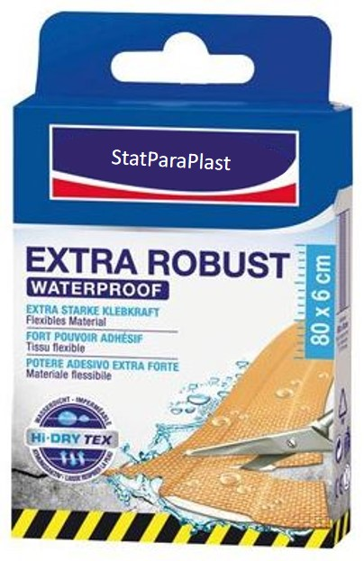

# {-}

{ width=100% }

# Vorwort {-}

Dieses Skriptum basiert (großteils) auf Literatur von Andy Field und Rand Wilcox [@FieldWilcox.2017], David Erceg-Hurn et.al. [@Hurn.2008], Mair [@Mair.2020] and Wilcox [@Wilcox.2012]. Teile der hier verwendeten Inhalte wurden unverändert aus der angegebenen Literatur übernommen.

# Einführung {-}

Kapitel 1: Einführung in die Einfache Lineare Regression

In einer Welt, die zunehmend von Daten geprägt ist, sind statistische Methoden unverzichtbare Werkzeuge, um Muster aufzudecken und fundierte Entscheidungen zu treffen. Die einfache lineare Regression ist eine der grundlegendsten, aber zugleich wirkungsvollsten Techniken in der Statistik. Sie ermöglicht es, den Zusammenhang zwischen zwei quantitativen Variablen zu modellieren und vorherzusagen, wie sich Änderungen in einer unabhängigen Variable auf eine abhängige Variable auswirken.

In diesem Kapitel werden wir die Grundlagen der einfachen linearen Regression erkunden: 

- Was bedeutet es, einen linearen Zusammenhang zwischen zwei Variablen zu postulieren? 
- Wie wird ein lineares Regressionsmodell aufgestellt und interpretiert? 

Durch anschauliche Beispiele und Schritt-für-Schritt-Anleitungen (in R) werden wir die Schlüsselkonzepte und mathematischen Grundlagen dieser Methode erläutern. 

Ziel ist es, Ihnen ein solides Verständnis für die einfache lineare Regression zu vermitteln, das als Basis für komplexere statistische Analysen dient. 

{ width=30% }

